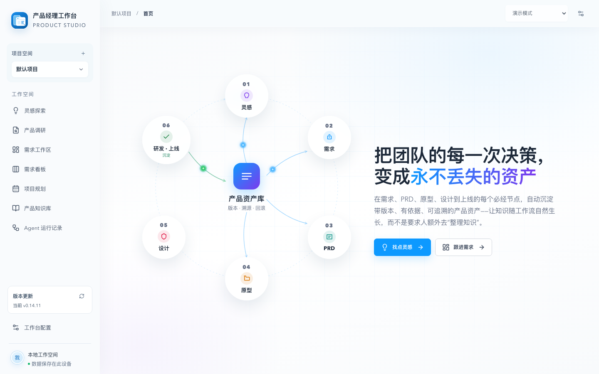
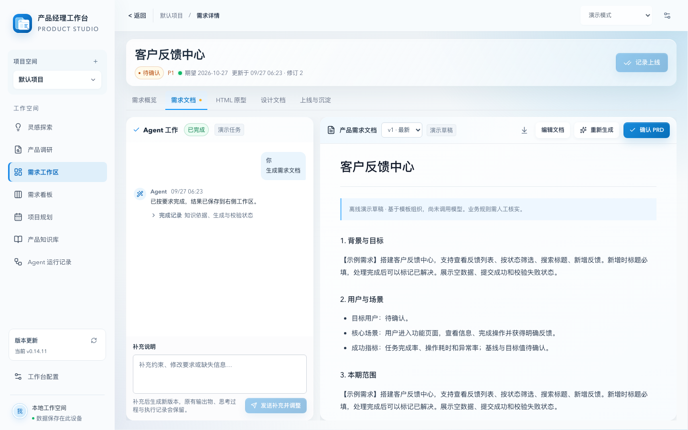
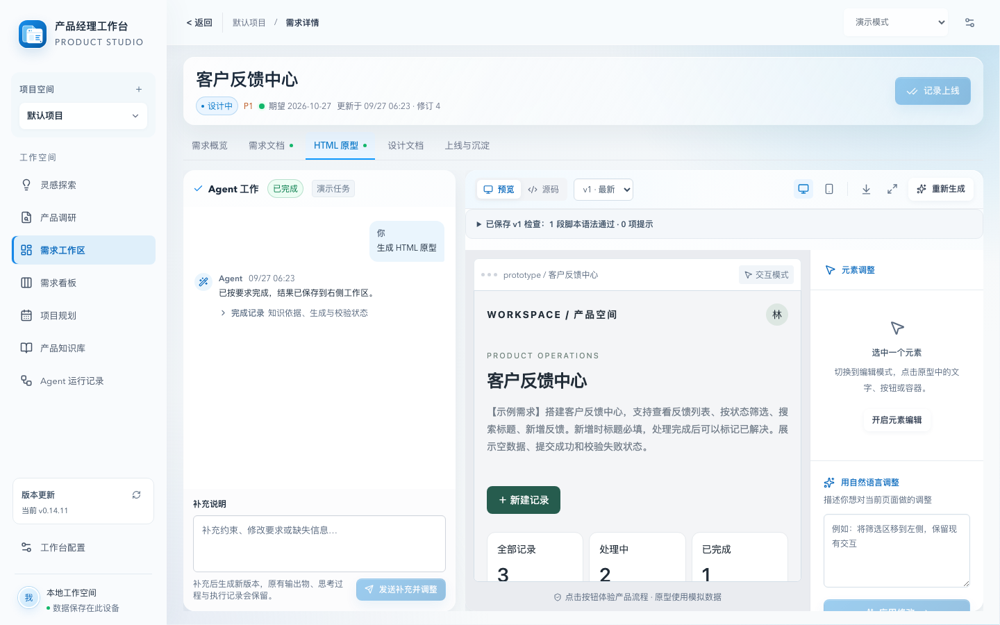

# 产品经理 Agent 工作台

**从灵感到上线，让每一次产品决策成为有版本、有依据、可追溯的资产。**

产品经理 Agent 工作台将灵感探索、产品调研、需求、PRD、可交互原型、设计文档、项目规划与产品知识连接在一条工作流中。通过对话澄清问题、整理需求、生成并审阅产物；上线后继续沉淀知识，让后续工作有据可查。

## 核心能力

- **探索与调研：**围绕用户、场景和目标展开对话，结合产品知识与来源证据整理需求。
- **需求到设计：**在同一工作区管理 PRD、HTML 原型和设计文档，支持编辑、确认、版本历史与恢复。
- **产品资产库：**保存知识、来源、版本和上线事实，提供检索、关系图谱与冲突提醒。
- **规划与跟进：**用需求看板、排期和 Agent 运行记录掌握产品工作进展。

## 界面预览

以下画面来自全新临时数据目录的离线演示模式。「客户反馈中心」是虚构示例，不包含真实项目资料。

**首页与产品资产流程**

**需求文档工作区**

**交互原型预览与调整**

## 下载

在 [Releases](https://github.com/RocLing26/pm-workstation-releases/releases) 获取正式版本和同名 SHA-256 文件。部署与升级步骤见压缩包内的 `INSTALL.md`。工作台可自行检查新版本并验证下载完整性。
